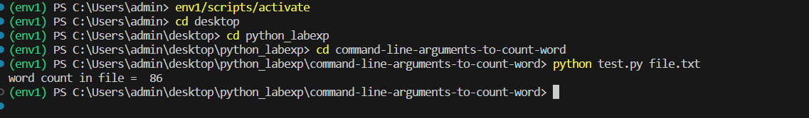

# command-line-arguments-to-count-word
## AIM:
To write a python program for getting the word count from the contents of a file using command line arguments.
## EQUIPEMENT'S REQUIRED: 
PC
Anaconda - Python 3.7
## ALGORITHM: 
### Step 1:
Import numpy as np
### Step 2: 
 Enter the input value
### Step 3: 
write a python program for getting the word count from the contents of a file using command line arguments.
### Step 4:  
Run the program
### Step 5: 
give the input 
### Step 6: 
end the program.
## PROGRAM:
```
'''
# developed by:HEMA LOKITHA P
# reg no: 23007550
'''
import sys
count= 0
with open(sys.argv[1],'r') as file:
    for line in file:
        word= line.split()
        count += len(word)

print("word count in file = ",count)
```

### OUTPUT:



## RESULT:
Thus the program is written to find the word count from the contents of a file using command line arguments.
